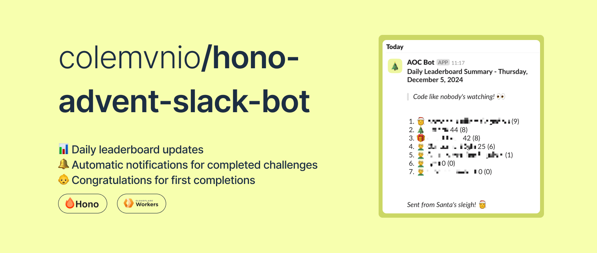

## ✨ Features

- 📊 Daily leaderboard updates: Deployed
- 🔔 Automatic notifications for completed challenges: Deployed

## 🚀 Getting Started

### Prerequisites

- Cloudflare Workers account
- Slack workspace with bot permissions
- Advent of Code account and session token
- Private leaderboard ID

### Environment Variables

```plaintext
AOC_LEADERBOARD_ID=your_leaderboard_id
AOC_SESSION_TOKEN=your_session_token
SLACK_WEBHOOK_URL=your_slack_webhook_placeholder
```

(!) For local development, you can create a `.dev.vars` file with the above variables.

### Installation

1. Clone the repository
2. Install dependencies with `npm install`
3. Deploy to Cloudflare Workers with `wrangler deploy`

### Running Locally

_(!) Warning: No endpoints are exposed or created, thus only running with crons enabled is possible._

1. Run the command: `npm run dev-cron`
2. Initialize your local KV Store with `npx wrangler kv key put --binding=LEADERBOARD_STATE "previous_state" "{}" --local`
3. Expected output: `Ready on http://localhost:8787`
4. Usage:
   - Open your browser, or use cURL
   - Type into the address bar: `http://localhost:8787/__scheduled?cron=CRON_EXPRESSION_HERE`
   - Cron examples: `0 12 * * *` (12pm daily), `*/15 * * * *` (every 15 minutes)
5. Expected behaviour: Based on the handler, if available, it will run the scheduled event.

## 🛠️ Tech Stack

- TypeScript
- Cloudflare Workers
- Hono Framework
- Slack API

## 📝 Usage

Once deployed, the bot will automatically:

- Fetch leaderboard updates
- Post daily summaries to your Slack channel
- Track participant progress
- Celebrate completions

---

Made with ❤️ by [Patrick](https://bento.me/patrick-c)
